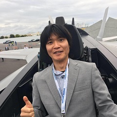

Kazuhisa NAKASHO
======================

Basic Information
---------------------
Birthday：Nov. 7th, 1978
Native place：Kawachi-nagano, Osaka, Japan
Height: 168cm, Weight: 61kg

Affiliation
---------------------
Associate Professor,
[Faculty of Software and Information Science](https://www.soft.iwate-pu.ac.jp/),
[Iwate Prefectural University](https://www.iwate-pu.ac.jp/)

Contact
----------------------
Address : 152-52 Sugo, Takizawa, Iwate, 020-0611, Japan
Email : nakasho_k [at] iwate-pu.ac.jp
TEL : +81-19-694-2624

Research interests
----------------------
Formalized mathematics, Proof assistant, Software engineering
Social implementation, Robotics, Signal processing and Image processing, Educational software
Cryptography and network security

Lectures
----------------------
Iwate Prefectural University
  - Career Design I (B2)
  - Fundamentals of Information SystemsⅡ (B2)
  - Software Engineering (B2)
  - Introduction to General Education II・Group Project Practice I/II (B1/B2/B3)
  - Social Presentation (M)
  
Other Information
----------------------
I love skiing and running.
I like mountains / cats better than seas / dogs.
I tend to sleep longer than others.

For more details
----------------------
[Researchmap](https://researchmap.jp/kazuhisa.nakasho)
[DBLP](http://dblp.uni-trier.de/pers/hd/n/Nakasho:Kazuhisa)
