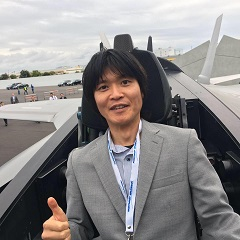

中正 和久 (なかしょう かずひさ)
======================

所属
---------------------
[山口大学](http://www.yamaguchi-u.ac.jp/) [大学院創成科学研究科](http://www.gsti.yamaguchi-u.ac.jp/) [工学系学域](http://www.eng.yamaguchi-u.ac.jp/) [知能情報工学分野](http://www.csse.yamaguchi-u.ac.jp/) 准教授

連絡先
----------------------
住所 : 〒755-8611 山口県宇部市常盤台2-16-1
メール :  nakasho [at] yamaguchi-u.ac.jp
電話 : 0836-85-9541

研究テーマ
----------------------
形式化数学，定理証明支援系，ソフトウェア工学
信号処理，画像処理
暗号セキュリティ

その他
----------------------
身長 168cm, 体重 57kg (昨年比 +2kg)
スキーとランニングが好き
海より山派，犬より猫派
ロングスリーパー気味

詳細情報
----------------------
[researchmap](https://researchmap.jp/kazuhisa.nakasho)
[DBLP](http://dblp.uni-trier.de/pers/hd/n/Nakasho:Kazuhisa)
